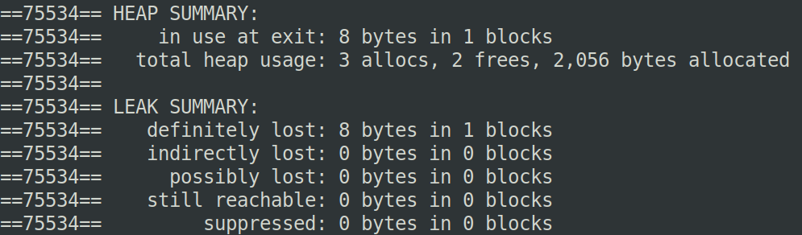
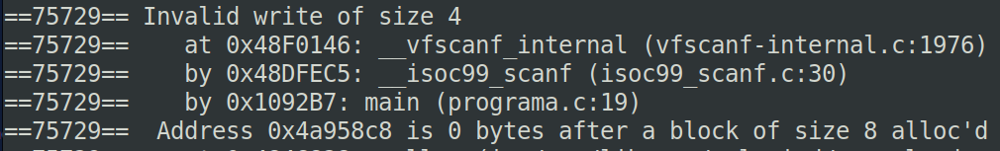

## Solución al ejercicio 16.7. Detectar errores de memoria.

Se ha elegido el Ejercicio 1, omitiendo la llamada a *free()*, lo que provoca una fuga de memoria intencionada. El código:

```C
#include <stdio.h>
#include <stdlib.h>

int main() {
   int n;
   printf("¿Cuántos números deseas introducir? ");
   scanf("%d", &n);
   
   int* numeros = (int*) malloc(n * sizeof(int));
   if (numeros == NULL) {
      printf("Error: no se pudo asignar memoria.\n");
      return 1;
   }
   
   for (int i = 0; i < n; i++) {
      printf("Número %d: ", i + 1);
      scanf("%d", &numeros[i]);
   }
   
   int suma = 0;
   for (int i = 0; i < n; i++) {
      suma += numeros[i];
   }
   
   printf("Suma: %d\n", suma);
   
   // ¡Olvidamos liberar la memoria!
   // free(numeros);
   
   return 0;
}
```

Para compilar con información de depuración:

```shell
gcc -g fuga_memoria.c -o fuga_memoria
```

Para ejecutar \textit{Valgrind}:

```shell
valgrind ./fuga_memoria
```

La parte fundamental de la salida por pantalla del análisis de \textit{Valgrind} es la que muestra la siguiente figura:



La figura muestra la salida del informe de Valgrind para el Código del Ejercicio 16.7. Valgrind informa que hay 8 bytes perdidos, lo cual corresponde a 2 enteros de 4 bytes cada uno (si se introdujeron 2 valores, por ejemplo). El bloque fue reservado con *malloc()* y nunca fue liberado.

Una alternativa sería forzar un acceso ilegal al array, más allá del último elemento, poniendo en el bucle:

```C
for (int i = 0; i <= n; i++) { // Error: debe ser i < n
   scanf("%d", &numeros[i]);
}
```

La salida de *Valgrind* en este caso será la de la siguiente figura:



Se puede ver que *Valgrind* ha detectado el acceso a una posición ilegal del array.
